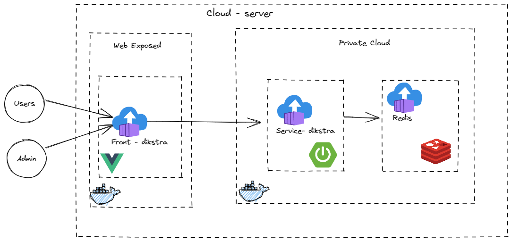

# 🛫airmap-dijkstra🛬

Projeto desenvolvido na materia de estrutura de dados

### 🚶‍♂️Passo a Passo para execução🚶‍♂️
- Clonar o repo ou baixar o mesmo
- Entrar em **back-end/service-dijkstra/target**
- Irá precisar somente dos arquivos docker(**Dockerfile** e **docker-compose.yaml**) e da pasta target(onde temos nossa applicação buildada).
- Após isso basta rodar o comando `docker compose up -d `

### Utilização da API
- Basta acessar o `http://localhost:8080/swagger-ui/index.html`
  - Onde possui todo o mapeamento de rotas, porém alguns parametros estão mapeados de forma erronia(peço perdao) e até mesmo porquê eu usei um serializer e deserializer

### Melhorias
-  Implementar autenticação
-  Inserir Tempo de vida dos dados no rediis

### Diagrama 

